Preliminary Info - CAUTION: may change! (it has indeed changed, need to update)

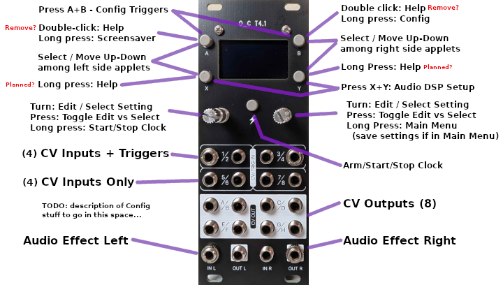

## Rev 3 issues:

C93 polarity is not indicated on silkscreen - fixed in new files

Mounting holes for display may be slightly off

Mounting holes for display should enlarge slightly to allow M2 screws

**3 beta testers had Teensy I/O pins damaged**, mostly encoders and pushbuttons.  If you build Rev 3, **USE A SOCKET** between Teensy and the CPU board.

Audio input clipping on 1 channel distorts other channel input - TODO: document resistors to change amplifier gain

Control board should allow more clearance for external trigger headers / wires

## Changes:

Diode d6 added to protect U17 during unusual power startup.

Capacitors C2, C3, C4, C5, C6, C7, C8, C9, C10, C11, C12 are not needed by newer Phazerville firmware.

# MIDI

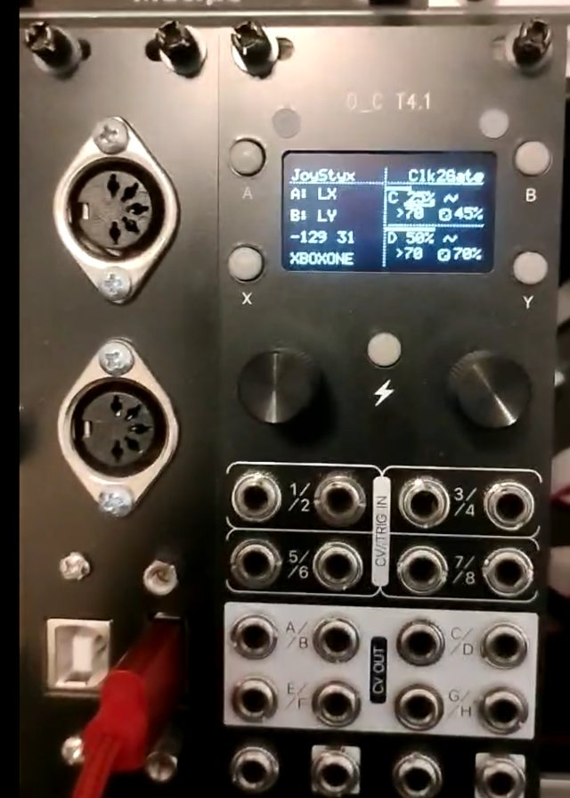

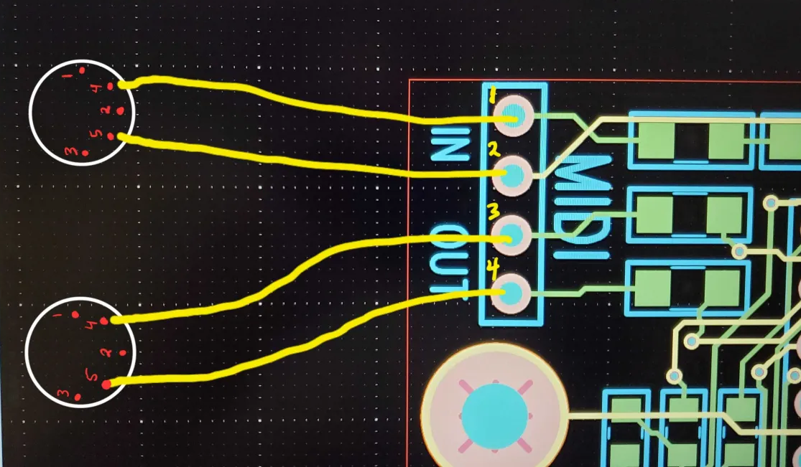

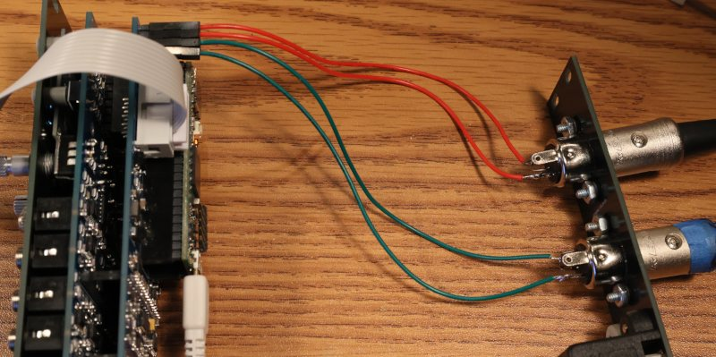

# USB Host

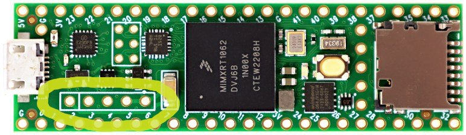

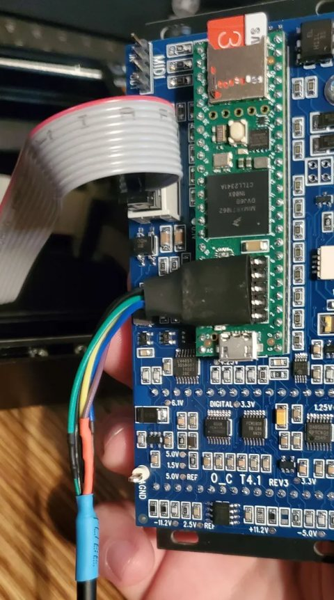

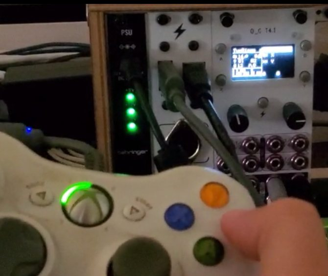

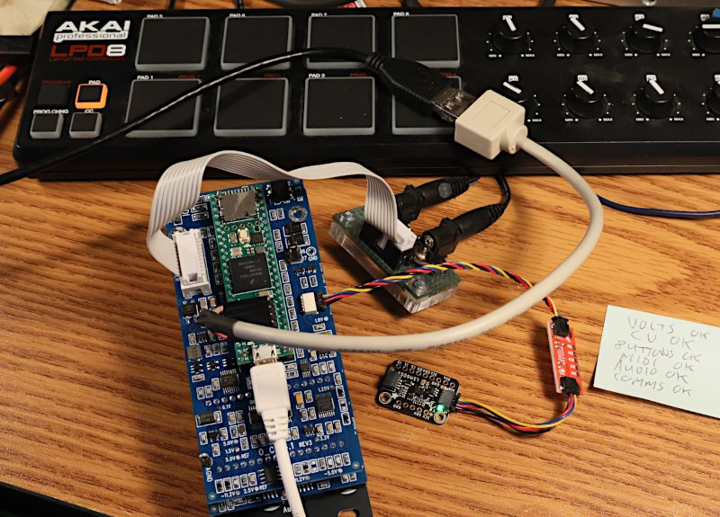

[USB Host Cable at SparkFun](https://www.sparkfun.com/usb-host-cable-for-teensy-4-1-and-teensy-3-6.html) - For connecting MIDI instruments, Gamepad controllers, maybe other stuff as software support develops...

[USB Device Cable at AdaFruit](https://www.adafruit.com/product/937) - For connecting to your PC or Mac, for upgrading [Phazerville firmware](https://github.com/djphazer/O_C-Phazerville), O_C can act as a MIDI device, and to run the [screen capture program](https://github.com/PaulStoffregen/Phazerville-Screen-Capture).

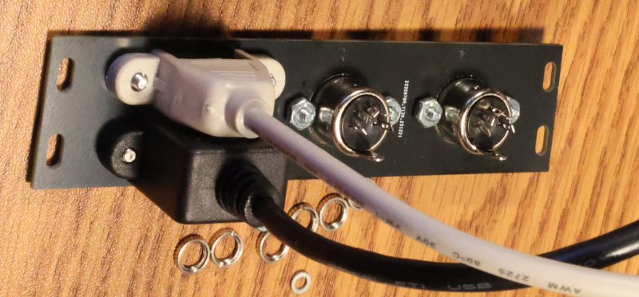

# Additional Memory

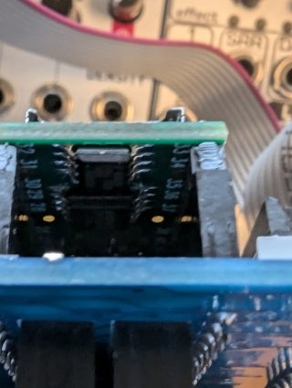

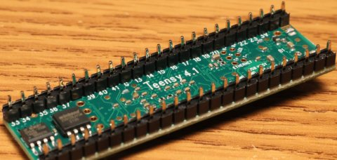

# External Trigger

Normally the 4 trigger inputs are connected (shared) to CV1-CV4.

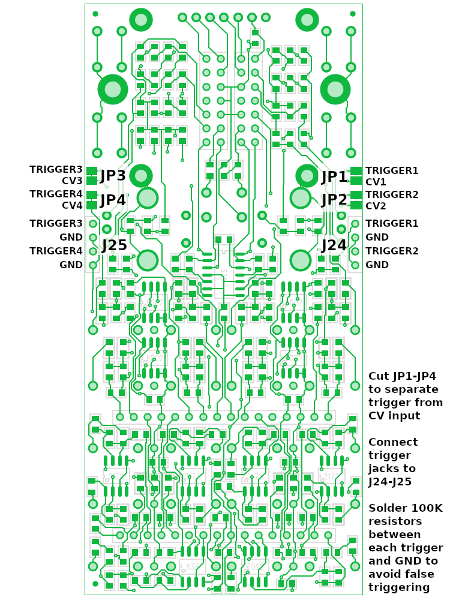

You can modify the hardware to separate the triggers from CV1-CV4.

Cut JP1-JP4 apart to disconnect the triggers from CV1-CV4.  Then
wire external trigger jacks to J24 and J25.  100K resistors are
also recommended between each trigger input and GND, to prevent
false triggering when the cable is "floating".

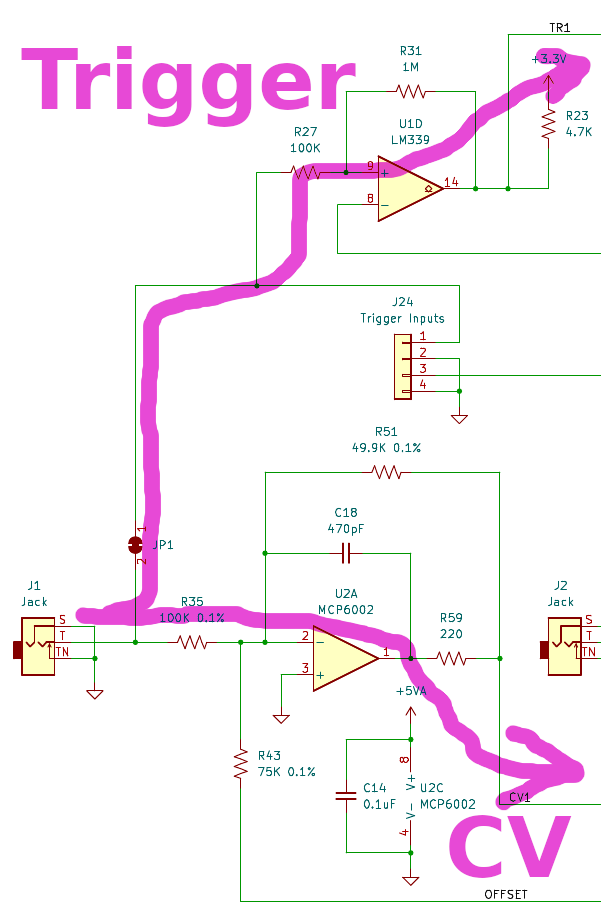

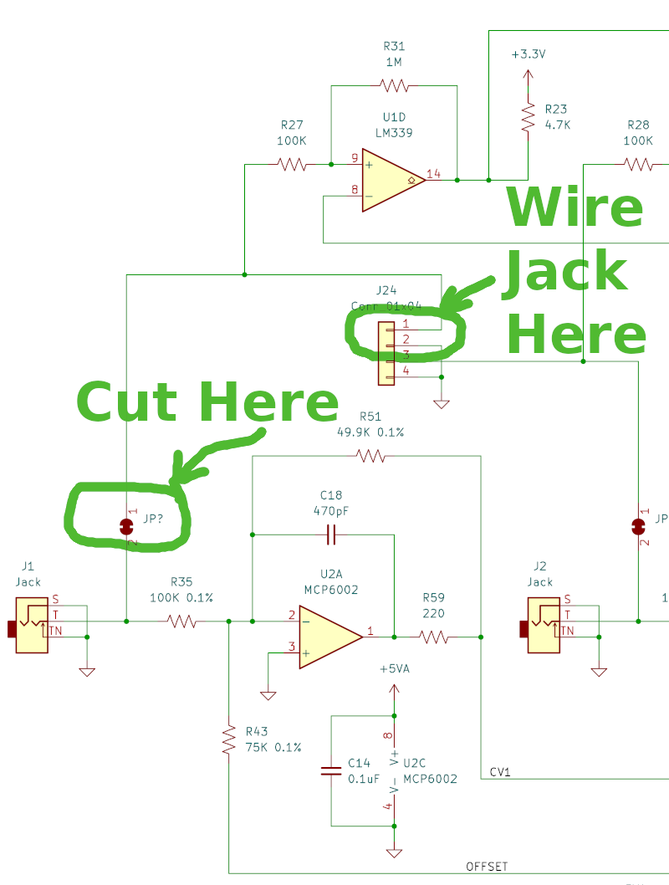

