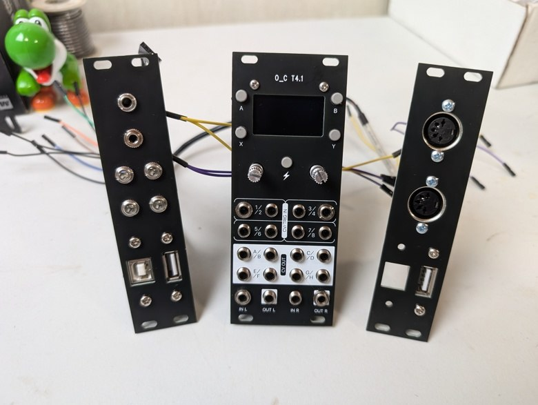

# O_C T4.1 - Ornament and Crime with Teensy 4.1

While porting the Ornament and Crime code to run on Teensy 4, the question kept
coming up "what can a 600 MHz processor let me do".  Turns out the extra memory
allows Phazerville firmware to support all applets in a single image.  But the
original hardware designed for Teensy 3.2 limits what Teensy 4.0 can do.  The
necessity to share a single SPI port's bandwidth between the display and DAC
chip is the main limit.

O_C T4.1 was born to allow Teensy 4.1 to be fully utilized by Phazerville
firmware.  Control Voltage (CV) input and output was doubled to 8 signals.
An ADC chip was added for higher quality CV input, free from the on-chip
digital noise of a CPU.  Most importantly, three fully independent SPI port
are used for the display, CV inputs, and CV outputs.  Technically, the CV
input SPI is "FlexIO" which adds control of an analog mux chip.  All 3 have
fully independent bandwidth.

Audio input and output were also added, using fully independent bandwidth
of the I2S (digital audio) port.  Serial for MIDI, 480 Mbit/sec USB host,
and I2C for future expansion are also available on connectors meant for
expansion modules.

Additional memory can be added to Teensy 4.1, in the form of a PSRAM chip
give extra memory useful for audio effects, and a SD card for non-volatile
storage.  As with everything else, these have fully independent bandwidth.
Everything has optimal access for Teensy 4.1.  Phazerville leverages
optimized drivers with Direct Memory Access (DMA) for all of these peripherals.
O_C T4.1 truly is optimized to let Ornament and Crime make the most of
the powerful Teensy 4.1 processor!

# Attribution ShareAlike

Huge thanks & credit to mxmxmx who designed to the original Ornament and Crime module
so many years ago when Teensy 3.2 was new.

In 2023 mxmxmx waived the non-commercial license term for O_C T4.1, so the open source
license is now CC BY-SA 4.0.  Paul Stoffregen is not concerned about attribution,
but any O_C T4.1 Ornament and Crime product should give appropriate credit to mxmxmx.

If you see commercially sold O_C T4.1 without even a tiny footnote for attribution,
please send the vendor a gentle and polite reminder that attribution to mxmxmx is
required.

# Rev 3 issues:

Solder pads (7 pins) for the display should be raised approximately 1mm, towards the
top edge of the board.  To make the display fit, usually the 7 header pins need to
be bent slightly.

**3 beta testers had Teensy I/O pins damaged**, mostly encoders and pushbuttons.  If you build Rev 3, **USE A SOCKET** between Teensy and the CPU board.

Audio input clipping on 1 channel distorts other channel input - TODO: document resistors to change amplifier gain

Control board should allow more clearance for external trigger headers / wires

# Changes

Thanks to recent work by Beau Seidon, the files are now fully converted to KiCad for easier
editing to spin your own design.  Diode D6 added to protect U17 during unusual power startup.
Gerber files o_c_3_analog_new_jlc.zip and o_c_3_cpu_new_jlc.zip have been built and tested,
so you can simply build from known-good files.  Or you can use the KiCad files to make your
own design.

Capacitors C2, C3, C4, C5, C6, C7, C8, C9, C10, C11, C12 are not needed by newer Phazerville firmware.

# MIDI

# Teensy Voltage and USB Host

O_C T4.1 rev3 uses a switching power supply to step down +12V modular power to
4.25V to run Teensy 4.1.  This voltage was chosen to reduce the load placed on
your +12V modular power rail.

However, when using USB host, Teensy 4.1 will supply about 4.1 volts to your
USB device.  This is below the 4.4V requirement of the USB 2.0 specification,
but most lower power USB devices which use a linear or step-down switcher to
3.3V typically can work.

If you want full 5 volt USB host power output, you have 2 options.

The best option is a powered USB hub, which also gives you the ability to
connect multiple USB devices!  If designing an add-on module, the USB hub chip
and power delivered to USB device would be best sourced from the modular +5V
power rail, generally meant for digital circuitry.  USB hub chips with
"Multiple Transaction Translators" (MTT) give better performance than "Single
Transaction Translator".  CH334 from WCH is a very low cost MTT hub chip
to consider, usually in stock at LCSC.

Or you can modify the O_C T4.1 power supply to provide 5V rather than 4.25V.
The trade off is O_C T4.1 will consume more power, because Teensy 4.1 uses
a linear regulator.  If using power hungry USB devices, they will also be
powered via the modular +12V rail, generally meant for analog circuitry.
The small step-down regulator on O_C T4.1 rev3 is limited to 600mA.  Teensy
4.1 typically consumes 110mA, but if a SD card is used it will also draw
current, leaving less available for USB devices.
To modify for 5V, if using the old gerber files add D6 by soldering on top
of C59.  Then increase R127 to 27K to change the power supply voltage.  If
using MIDI OUT, change R139 and R140 to 120 ohms for proper MIDI current.

# USB Host

[USB Host Cable at SparkFun](https://www.sparkfun.com/usb-host-cable-for-teensy-4-1-and-teensy-3-6.html) - For connecting MIDI instruments, Gamepad controllers, maybe other stuff as software support develops...

[USB Device Cable at AdaFruit](https://www.adafruit.com/product/937) - For connecting to your PC or Mac, for upgrading [Phazerville firmware](https://github.com/djphazer/O_C-Phazerville), O_C can act as a MIDI device, and to run the [screen capture program](https://github.com/PaulStoffregen/Phazerville-Screen-Capture).

# Additional Memory

# External Trigger

Normally the 4 trigger inputs are connected (shared) to CV1-CV4.

You can modify the hardware to separate the triggers from CV1-CV4.

Cut JP1-JP4 apart to disconnect the triggers from CV1-CV4.  Then
wire external trigger jacks to J24 and J25.  100K resistors are
also recommended between each trigger input and GND, to prevent
false triggering when the cable is "floating".

